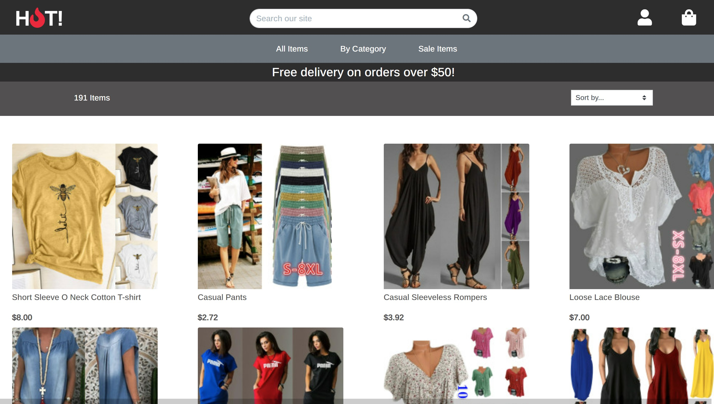
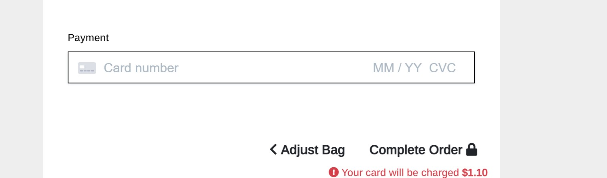

# Hot
(Developer: Fergal Quinn)


[View live site](https://ci-pp5-hot.herokuapp.com/)

** For testing payment with this site please use the following card details:**

A regular user has been setup with the username of customer and password of custpass

+ When making a payment as a regular user, a test credit card of 4242424242424242 has been set up for the card number
For the expiry date, cvc and postal code any series number(s) can be used(once they meet the mimimum values)

## Table of Content

1. [Strategy](#project-goals)
    1. [Site Owner Goals](#site-owner-goals)
    2. [User Goals](#user-goals)
    3. [Target Audience](#target-audience)
    3. [Business Model](#business-model)
    4. [SEO](#seo)
    5. [Marketing](#marketing)
2. [Structure](#structure)
    1. [Website pages](#website-pages)
    2. [Code Structure](#code-structure)
    3. [Database](#database)
    4. [Physical database model](#physical-database-model)
    5. [Models](#models)
        1. [User Model](#user-model)
        2. [UserProfile Model](#userprofile-model)
        3. [Product Model](#product-model)
        4. [Category Model](#category-model)
        5. [Brand Model](#brand-model)
        6. [Size Model](#size-model)
        7. [Color Model](#color-model)
        8. [Inventory Model](#inventory-model)
        10. [Course Model](#contact-model)
        11. [Contact Model](#reason-model)
        12. [Faq Model](#about-model)
    3. [Scope](#scope)
        1. [User Stories](#user-stories)
    4. [Skeleton](#skeleton)
        1. [Wireframes](#wireframes)
    5. [Surface](#surface)
        1. [Design Choices](#design-choices)
        2. [Colour](#colours)
        3. [Fonts](#fonts)
5. [Technologies Used](#technologies-used)
    1. [Languages](#languages)
    2. [Frameworks & Tools](#frameworks-&-tools)
6. [Features](#features)
7. [Testing](#validation)
    1. [HTML Validation](#HTML-validation)
    2. [CSS Validation](#CSS-validation)
    3. [JS Validation](#JS-validation)
    4. [Python Validation](#py-validation)
    5. [Accessibility](#accessibility)
    6. [Performance](#performance)
    7. [Device testing](#performing-tests-on-various-devices)
    8. [Browser compatibility](#browser-compatibility)
    9. [Testing user stories](#testing-user-stories)
8. [Bugs](#Bugs)
9. [Deployment](#deployment)
10. [Credits](#credits)
11. [Acknowledgements](#acknowledgements)

# User Experience
## Strategy

### Site Owner Goals

The primary goal of the website from the site owners perspective is as follows:
- To enable customers to purchase products listed on the site
- To allow a user to navigate the website and view product details
- To allow a user to create an account & log in to an existing account
- To allow a user to view their order history and account details
- To allow users to keep updated with a newsletter signup
- To be able to edit, add and remove products from the site

### User Goals
The primary goal of the website from a site users perspective is as follows:
- To view products and product details
- To easily search for products
- To filter products 
- To register for an account
- To log into/out of an existing account
- To be able to view and edit their account profile
- To add a product to bag and purchase order
- To be able to view order history
- To contact the site owner
- To sign up to a newsletter

### Target Audience
- Ladies
- Fashion concious
- Primary age is 18-40 but there would be some market for 13-18 and 40+

## User Requirements and Expectations
- An easy navigation system with instant learning.
- Able to navigate the site quickly and easily.
- No broken links.
- Responsive and visually appealing on all devices.
- Ability to view products and complete purchases
- Ability to contact the business

## Business Model

The primary goal for this project is to sell womens summer fashions direct to the consumer, thus it's a B2C business model. Given the target audience, I've branded the website with a short catchy name, in keeping with the product line. The hero image is a youthful, fun image that encourages user to view the clothing range. 

The site has an easy navigation and has some nice features like wishlist and sales which are quite popular in this business. The model is based on fulfillment done in-house but the model would work with outsourcing fulfilment.

## SEO

Long tag and short tag keyword were searched for in regards to SEO using Google tools and other online resources.  These tags have been used in the main HTML head and throughout the project to name images and within main body text.


For this project, I did not give consideration to the naming of pictures given the amount of them. If I were to use this site in real life, I would name every picture according more in keeping with the product name. For example - the product [Bathing Suit](https://ci-pp5-hot.herokuapp.com/clothes/26/) has an image that is named 'white_bathing_suit.jpg'. Due to time constraints, I could not rename all pictures from the dataset used for the project.

Future development in the site includes a Blog that can help keep fresh content on the site.

## Marketing

### Facebook Business Page


### Newsletter Signup
The site includes a signup form to a newsletter so the business can keep in touch with it's vistors.

## Structure
### Code Structure
The project is organised into a variety of applications, as is constructed using the Django Framework.

App details as follows:

- Home - this app contains information about HOT Summer Fashions home page. It's got easy links to the product page, contact-us and with quick links to category pages, items on sale, wishlist and the shoppers bag.

It contains a footer with links to external sites and a mailchimp signup form.

- Clothes - this app contains the the clothes listings and detail views, users can add items to a shopping cart, filter for items in categories and hosts the results of the product search.  Clicking individual items opens a sub  page where users can see detailed product information.  The clothes app has a wishlist button that allows user to mark items they may wish to purchase in the future.

- Courses - Users can view course listings and details and be redirected to the contact form to get in touch and enquire.
- Contact - this app is for users to be able to submit a message to the site owners and recieve acknowledgment. For users with a profile, when logged in, the form prepopulates profile data to remove friction to the user.
- Profile - Users can choose to have a profile either when checking out or when authenticated.  Edit functionality exists and users can view thier purchase history. There is also functionality for submitted support tickets for registered users.
- Bag - User can view, add and remove products that they have added to the bag
- Checkout - Users can use the checkout app to purchase selected items.  They can see items in the cart and have the option to save profile data during the checkout process.

To complement the apps there are
- project: Project level files - settings.py for project level settings and urls.py to route the website URLS
- templates: Containing the base.html, allauth(django authentication)
- templates (app level): each app has it's own templates directory for HTML to consider portability and re-use.
- urls (app level): each app has it's own url.py file to consider portability and re-use.
- static: Base css and Javascript files
- manage.py: This file is used to start the site and perform funcions during development
- README.md: Readme documentation
- Procfile: To run the application on Heroku
- Requirements.txt: Containing the project dependencies
Note: Environment variable values are not exposed in the source code, they are stored locally in env.py that is not checked in(and listed in .gitignore, and on Heroku in app settings
### Database
#### Physical database model

This model contains all fields stored in the database collections with their data type and mimics the structure of what is actually stored in the Postgres database 
<br>

#### Models


##### User Model
- The User model contains information about the user. It is part of the Django allauth library
- The model contains the following fields: username, password, first_name, last_name, email, is_staff, is_active, is_superuser, last_login, date_joined

##### UserProfile Model
- The UserProfile model contains information about the users address.  This can be created at anytime through the nav link or automatically added post checkout.  The UserProfile Model contains the following fields: userdefault_phone_number,default_street_address1,default_street_address2,default_town_or_city,default_county,default_postcode,default_country.

##### Clothes Model

- The Clothes model contains information about products available within each of the categories
- It contains Category as a foreign-key.
- It contains wishlist as a Many-toMany relationship.
- The model contains the following fields:  name, description, has_sizes, price, rating, stock, image_url, wishlists, on_sale.

##### Sale Model

- This model deals with items on sale and contains information on clothes, percent discount, start date, end date and sale price. The clothes field has a one to one relationship with the clothes model.

##### Order Model

- The category model contains information relating to an individual order. It has a foreign key of user profile.
- The model contains the a number of user location fields like country, postcode etc.. It also includes the following fields - delivery_cost, order_total, grand_total, origional_bag, stripe_pid

##### OrderLineItem

- This model has a foriegn key of order. It contains the items in an order.
- The model contains the following fields - order, item, item_size, quantity, lineitem_total

##### Contact Model

- This model is used to deal with contact enquiries from the website.
- The models contains the following fields - name, email, phone, message


##### Support Tickets Model

- This model is to deal with support tickets from registered users of the site.
- The model contains the following fields - user (FK), title, query, status, created_on, updated_on

##### Ticket Messages Model

- This model is to deal with messages relating to a support ticket. It has foreign keys of tickets and user. Other fields in the model are create_on and message


## Scope
### User stories:

| **EPIC 1**  | **Account authentication, to allow users to create an account**                                                                                                                            |
|-------------|--------------------------------------------------------------------------------------------------------------------------------------------------------------------------------------------|
| 1.1         | As a shopper I can register as a site user so that I can login in future and my personal data is saved for future checkouts                                                                |
| 1.2         | As a shopper I can see my current logged in status so that I know whether I need to login                                                                                                  |
| 1.3         | As a shopper I can see saved information about me so that I can verify if it's correct or if it needs updating                                                                             |
| 1.4         | As a shopper I can see my previous orders so that I can see what I have ordered in the past                                                                                                |
| 1.5         | As a shopper I can update my personal information so that I can keep it up to date                                                                                                         |
| 1.6         | As a shopper I can delete my account so that I can permanently erase all information relating to me                                                                                        |
| 1.7         | As a shopper I can login to my account so that I can start using it                                                                                        |
| 1.8         | As a registered user I can view and edit my profile information so that I can keep it up to date                                                                                        |
| **EPIC 2**  | **List/view products, to display all products availabe for sale**                                                                                                                          |
| 2.1         | As a shopper I can view products for sale so that I can consider purchasing them                                                                                                           |
| 2.2         | As a shopper I can view more detail about a product so that I can find out more if I am interested in purchasing                                                                           |
| 2.3         | As a shopper I can view all products in categories so that I can quickly find what I am looking for                                                                                        |
| 2.4         | As a shopper I can search all products by title and by description so that I can quickly find what I am looking for                                                                        |
| 2.5         | As a shopper I can filter products so that I can quickly find out what I am looking for                                                                                                    |
| 2.6         | As a shopper I can sort products by important attributes so that I can easily navigate the product range                                                                                   |
| 2.7         | As a shopper I can see if a product is out of stock so that I can see if it's available for purchase                                                                                       |
| **EPIC 3**  | **Add products to shopping bag, to allow users to create a record of items they wish to purchase**                                                                                         |
| 3.1         | As a shopper I can add items to my basket so that I can purchase them at checkout stage                                                                                                    |
| 3.2         | As a shopper I can add and delete items from my baskets so that I can adjust my purchase                                                                                                   |
| 3.3         | As a shopper I can see the total cost of the shopping bag so that I am aware of the running cost                                                                                           |
| 3.4         | As a shopper I can adjust quantities in my basket so that I can adjust my basket                                                                                                           |
| 3.5         | As a shopper I can easily see the products in my shopping bag so that I know what I have in it                                                                                             |
| **EPIC 4**  | **Checkout bag, to allow users to buy products**                                                                                                                                           |
| 4.1         | As a shopper I can select checkout from my shopping bag so that I can start the checkout process                                                                                           |
| 4.2         | As a shopper I can verify the shopping bag before I commit to the purchase so that I can ensure everything is OK                                                                           |
| 4.3         | As a site user I can choose to save my checkout details for next time so that I can use the details for future purchases                                                                   |
| 4.4         | As a shopper I can receive an email confirmation detailing my order so that I know my order was processed                                                                                  |
| 4.5         | As a shopper I can have my order processed even if I exit out of the page before I recieve final confirmation or the connection breaks so that I have security that my order was processed |
| 4.6         | As a shopper I can input my credit card details so that I can purchase the items in my basket                                                                                              |
| 4.7         | As a shopper I can have my credit card transaction processed so that I can pay for my basket of items                                                                                      |
| **EPIC 5**  | **Ratings and reviews, to allow users to have their opinion about products**                                                                                                               |
| 5.1         | As a shopper I can rate products that I have purchased so that I can provide feedback to others considering the products                                                                   |
| 5.2         | As a shopper I can leave a comment on products I have purchased so that I can provide further detail on what I think                                                                       |
| 5.3         | As a shopper I can see reviews on products so that see what others have to say about products                                                                                              |
| **EPIC 6**  | **Admin accessibility, to allow admin users to modify the database of products**                                                                                                           |
| 6.1         | As a shop owner I can add products to the shop so that the shop can have more variety available                                                                                            |
| 6.2         | As a shop owner I can edit / update product so that the description and price is up to date                                                                                                |
| 6.3         | As a shop owner I can delete product so that I remove products no longer available                                                                                                         |
| 6.4         | As a shop owner I can review/edit or delete customer orders so that I can make any necessary adjustments                                                                                   |
| 6.5         | As a non-site admin I can not access the admin pages so that I am unable to take actions with admin privilages                                                                             |
| 6.6         | As a site admin I can update the stock levels of a product so that the levels are kept up to date                                                                                          |
| **EPIC 7**  | **Like button/Wishlist - allow users to like a products / add to wishlist**                                                                                                                |
| 7.1         | As a shopper I can like a product so that I can filter liked products later                                                                                                                |
| 7.2         | As a shopper I can purchase and product and it will be taken off my wishlist so that my wishlist is up to date                                                                                                                  |
| 7.3         | As a shopper I can view/edit products on my wishlist so that I can keep it up to date                                                                                                                                                |
| **EPIC 8**  | **Sale items - Mark items on sale and apply a cretain discount to the items**                                                                                                              |
| 8.1         | As a shop owner I can mark certain items/catgories as for sale so that I can entice people to buy them                                                                                     |
| 8.2         | As a shopper I can easily see items on sale so that I might consider purchasing them                                                                                                       |
| **EPIC 9**  | **Newsletter**                                                                                                                                                                             |
| 9.1         | As a shopper I can sign up to a newsletter so that I can keep informed of offers                                                                                                           |
| 9.2         | As a shopper I can remove myself from the newsletter list so that I can stop receiving emails                                                                                              |
| 9.3         | As an admin I can view all members on the newsletter list so that I can use the information for mail shots etc.                                                                            |
| **EPIC 10** | **Contacts us (user registration not required)**                                                                                                                                           |
| 10.1        | As a shopper I can make contact with the store via a form on the site so that I can receive feedback on any questions I have                                                               |
| 10.2        | As a shop owner I can view customer enquiries so that I can respond to them as required                                                                                                    |
| 10.3        | As a shopper I can receive confirmation that I have submitted an enquiry so that I know it has been received                                                                               |
| **EPIC 11** | **User support messages (user registration required)**                                                                                                                                     |
| 11.1        | As a user I can submit a support ticket so that I can get responses to queries I have                                                                                                      |
| 11.2        | As a shop owner I can view support queries and repsond to them as required so that I can keep my customers happy                                                                           |                                                                        |

#### Error Flow

## Skeleton

### Wireframes

<details><summary>Home</summary>

</details>

<details><summary>Category Page/View All</summary>

</details>

<details><summary>Product Details</summary>

</details>

<details><summary>Shopping Bag</summary>

</details>

<details><summary>Checkout</summary>

</details>

<details><summary>Login Page</summary>

</details>

<details><summary>Support Page</summary>

</details>

<details><summary>Profile Page</summary>

</details>

## Surface

### Design choices

### Colours

### Typography

## Features

The site consists of 11 pages, with the features detailed under each page.

### Page 1 – Home page

<br>
The home page consists of the following features:
#### Feature 1 – Header and navigation bar
The header contains the logo, products link, categories link, search bar, user account and shopping bag. It also shows the wishlist for users that are logged in. The header is visible across all pages.

This feature covers the following user stories:

*1.2 As a shopper I can see my current logged in status so that I know whether I need to login

*2.1 As a shopper I can view products for sale so that I can consider purchasing them

*2.3 As a shopper I can view all products in categories so that I can quickly find what I am looking for

*2.4 As a shopper I can search all products by title and by description so that I can quickly find what I am looking for

*7.3 As a shopper I can view/edit products on my wishlist so that I can keep it up to date

#### Feature 2 – Search bar
<br>

The search bar is part of the header and features across all pages. This allows the user to easily search products by brand, product type, colour. 

This feature covers the following user stories:

*2.4 As a shopper I can search all products by title and by description so that I can quickly find what I am looking for

#### Feature 3 – Hero Image
<br>

The hero image gives the user an immediate idea of what the site is about with the heading 'summer fashions' and button to 'shop now'. 

This feature covers the following user stories:

*2.1 As a shopper I can view products for sale so that I can consider purchasing them (SHOP NOW Button)

#### Feature 4 – Footer
<br>

The footer appears across all pages, and contains links to direct the user to all main pages – shop, information, account. It includes a sign-up to newsletter/mailing list and links to the social media accounts.

This feature covers the following user stories:

*1.1 As a shopper I can register as a site user so that I can login in future and my personal data is saved for future checkouts

*2.1 As a shopper I can view products for sale so that I can consider purchasing them

*9.1 As a shopper I can sign up to a newsletter so that I can keep informed of offers

#### Feature 5 - Logged in Status
For users who have not logged in yet, when they click the user icon to top right of screen, they are displayed the following drop-down
<br>

For user who have logged in, they are displayed with a different menu. Note - Product Management only displays for admin and supervisors.

<br>

This feature covers the following user stories:

*1.2 As a shopper I can see my current logged in status so that I know whether I need to login

#### Feature 6 - Wishlist
For registered users who have logged in - the wishlist will display in the navbar.
<br>

This feature covers the following user stories:

*7.3 As a shopper I can view/edit products on my wishlist so that I can keep it up to date


### Page 2 – Shop
<br>
The shop page consists of the following features:

#### Feature 1 – Product Sort
<br>

The product sort feature allows a user to sort the products displayed on the page by price, rating, category or name.

This feature covers the following user stories:

*2.6 As a shopper I can sort products by important attributes so that I can easily navigate the product range

#### Feature 2 – Product Details

If a user clicks on any of the product images, they are brought to the product detail page which contains further information about the product.

This feature covers the following user stories:

*2.2 As a shopper I can view more detail about a product so that I can find out more if I am interested in purchasing

#### Feature 3 – Managing product details
<br>
If the shop owner/admin would like to update or delete the products available for sale, then can do so on this page by clicking the relevant links. These links only display for supervisors.

This feature covers the following user stories:

*6.2 As a shop owner I can edit / update product so that the description and price is up to date

*6.3 As a shop owner I can delete product so that I remove products no longer available

#### Feature 4 – Site Pagination
<br>
Given the site can have alot of products to display, the number of products displayed on any one page is limited to 16 and the rest are paginated.

This feature covers the following user stories:

*2.1 As a shopper I can view products for sale so that I can consider purchasing them

#### Feature 5 – Product Count
<br>
There can be alot of products to display on a page or the used might have selected a certain category of products. It is useful to know how many products fit the criteria the shopper is filtering for.

This feature covers the following user stories:

*2.5 As a shopper I can filter products so that I can quickly find out what I am looking for

### Page 3 – Product Detail
<br>
The product detail page consists of the following features:

#### Feature 1 – Select Size
<br>
For items that have a size (most of the items on this site), shoppers can select size on the product page before adding it to the cart.

This feature covers the following user stories:

*3.1 As a shopper I can add items to my basket so that I can purchase them at checkout stage

#### Feature 2 – Add to cart
<br>
If a shopper is interested in purchasing an item, them can click the 'add to bag' button and add it to their bag.

This feature covers the following user stories:

*3.1 As a shopper I can add items to my basket so that I can purchase them at checkout stage

### Page 4 – Log In/Log-out
<br>
The login page consists of the following features:

#### Feature 1 – Log-in
<br>
The sign in page allows registered users to sign into their account using their username and password.

This feature covers the following user stories:

*1.7 As a shopper I can login to my account so that I can start using it

#### Feature 2 – Join
<br>
The join page allows unregistered users to sign up for an account.

This feature covers the following user stories:

*1.1 As a shopper I can register as a site user so that I can login in future and my personal data is saved for future checkouts

#### Feature 3 – Password Reset
<br>
The password reset feature allows a user to reset their password if they have forgotton it.

#### Feature 4 – Password Reset
<br>
The password reset feature allows a user to reset their password if they have forgotton it.

#### Feature 5 – Logout
<br>
While this is technically a feature of the navbar, this allows a user to logout of their account

### Page 5 – Profile 
The profile page consists of the following features:
#### Feature 1 – Profile information 
<br>

When the user is logged in or registered, they are able to view their profile. This features their personal details which they are able to update and change.

This feature covers the following user stories:

*1.8 As a registered user I can view and edit my profile information so that I can keep it up to date
*1.1 As a shopper I can register as a site user so that I can login in future and my personal data is saved for future checkouts

#### Feature 2 – View Previous Orders
<br>

A registered user can view a list of their previous orders.

This feature covers the following user stories:

*1.4 As a shopper I can see my previous orders so that I can see what I have ordered in the past

### Page 6 – Shopping Bag
<br>
The shopping bag page consists of the following features:

#### Feature 1 – Update Quantities
<br>

A user can update the quantities of an item in their baseket using the dropdown menu and then clicking the update button

This feature covers the following user stories:

*3.4 As a shopper I can adjust quantities in my basket so that I can adjust my basket

#### Feature 2 – Delete items from bag
<br>

A user can delete an item from their shopping bag.

This feature covers the following user stories:

*3.2 As a shopper I can add and delete items from my baskets so that I can adjust my purchase

#### Feature 3 – Checkout
<br>

A user can choose to proceed to checkout from their bag in order to complete their purchase

This feature covers the following user stories:

*4.1 As a shopper I can select checkout from my shopping bag so that I can start the checkout process

### Page 7 – Wishlist
<br>
The wishlist page consists of the following features:

#### Feature 1 – View/Edit Wishlist
<br>

If user would like to remove an item from their wishlist that had been previously added, they can just click on the heart icon.

This feature covers the following user stories:

*7.3 As a shopper I can select checkout from my shopping bag so that I can start the checkout process

### Page 8 – Checkout
<br>
The checkout page consists of the following features:

#### Feature 1 – Complete Delivery Details

On checkout, the user must enter their delivery details. If they are a registered user, their saved details are pre-populated.

This feature covers the following user stories:

*4.1 As a site user I can choose to save my checkout details for next time so that I can use the details for future purchases

#### Feature 2 – Order Summary
<br>

Before completing the checkout procress, the user can see an order summary which summarises what the user is purchasing.

This feature covers the following user stories:

*4.2 As a shopper I can verify the shopping bag before I commit to the purchase so that I can ensure everything is OK

#### Feature 3 – Save to profile
<br>

On checkout a registered user has the option of saving their delivery details to their profile so that they can be used when they checkout next time.

This feature covers the following user stories:

*1.1 As a shopper I can register as a site user so that I can login in future and my personal data is saved for future checkouts
*4.3 As a site user I can choose to save my checkout details for next time so that I can use the details for future purchases

#### Feature 4 - Fill out credit card details and proceed to payment
<br>

After validating their order and filling in their delivery details, a user can proceed to complete the purchase by entering their credit card details

There is validation messages that display messages from stripe.
<br>

This feature covers the following user stories:

*4.6 As a shopper I can input my credit card details so that I can purchase the items in my basket
*4.7 As a shopper I can have my credit card transaction processed so that I can pay for my basket of items

### Page 9 – Contact us
<br>
The contact us consists of the following features:

#### Feature 1 - Send message
<br>   

A user or an unregistered user can send a message to the shop.

This feature covers the following user stories:

*10.1 As a shopper I can make contact with the store via a form on the site so that I can receive feedback on any questions I have

#### Feature 2 - Send message (TBC)

This feature covers the following user stories:

*10.3 As a shopper I can receive confirmation that I have submitted an enquiry so that I know it has been received

### Page 10 – Support
<br>
The support centre consists of the following features:

#### Feature 1 - View Support Tickets
Registered users can view their open support tickets

#### Feature 2 - Submit a support ticket
<br>

Features 1 & 2 cover the following user stories:

*11.1 As a user I can submit a support ticket so that I can get responses to queries I have

#### Feature 3 - Submit a message relating to a support ticket
<br>
Users can submit further support messages relating to a support ticket. This can allow them provide further detail and allow dialogue with the support team.

#### Feature 4 - Users can mark a support query as resolved

Users can mark support tickets as resolved so that it no longer shows in their open support queries.

### Page 11 – Admin


## Technologies Used

### Languages

- [HTML5](https://en.wikipedia.org/wiki/HTML5)
- [CSS3](https://en.wikipedia.org/wiki/CSS)
- [JS ES6](https://en.wikipedia.org/wiki/JavaScript)
- [Django](https://www.djangoproject.com/)
- [Python3](https://en.wikipedia.org/wiki/Python_(programming_language))

#### Python Libraries

- asgiref==3.5.2
- backports.zoneinfo==0.2.1
- boto3==1.24.72
- botocore==1.27.72
- dj-database-url==1.0.0
- Django==3.2.15
- django-allauth==0.51.0
- django-countries==7.2.1
- django-crispy-forms==1.14.0
- django-extensions==3.2.1
- django-heroku==0.3.1
- django-mathfilters==1.0.0
- django-storages==1.13.1
- graphviz==0.20.1
- gunicorn==20.1.0
- jmespath==1.0.1
- oauthlib==3.2.0
- Pillow==9.2.0
- psycopg2==2.9.3
- psycopg2-binary==2.9.3
- pydot==1.4.2
- PyJWT==2.4.0
- python3-openid==3.2.0
- pytz==2022.2.1
- requests-oauthlib==1.3.1
- s3transfer==0.6.0
- sqlparse==0.4.2
- stripe==4.1.0
- whitenoise==6.2.0

### Frameworks & Tools

- [Bootstrap 4.6](https://getbootstrap.com/docs/4.6/getting-started/introduction/) - for general site layout, grid, flex.
- [Font Awesome v 5](https://fontawesome.com/v5/docs/) - for various icons in the site
- [Postgres](https://www.postgresql.org/) - the site is deployed on Heroku using a Postgress database.
- [SQLLite](https://www.sqlite.org/index.html) - this database was used in local development.
- [Gitpod](https://gitpod.io/) - my IDE of choice for this project.
- [Github](https://github.com/) - used as the code repository.
- [Google Fonts](https://fonts.google.com/) - used for the main body font and some headings.
- [Balsamiq](https://balsamiq.com/) -  used to create the website wireframes.
- [JQuery](https://jquery.com) - JQuery was used in some javascript files for DOM manipulation
- [CSS Validation Service](https://jigsaw.w3.org/css-validator/) - for validation of the css in the project.
- [HTML Markup Validation Service](https://validator.w3.org/) - for validation the HTML in the project.
- [Chrome dev tools](https://developer.chrome.com/docs/devtools/) - troubleshooting and debugging of the project code.
- [Chrome Lighthouse](https://developers.google.com/web/tools/lighthouse) - for performance, accessibility, progressive web apps, SEO analysis of the project code.
- [Responsive Design](http://ami.responsivedesign.is/) - for website mockup.
- [JSHint](https://jshint.com/) - for javascript validation.
- [PEP8](https://www.python.org/dev/peps/pep-0008/) - for python validation.
- [Facebook](https://www.facebook.com) - for social media marketing
- [Stripe](https://stripe.com/gb) - For payments
- [Amazon Web Services](https://aws.amazon.com/) - For static file hosting

## Validation

### HTML Validation

<details><summary>Page 1 - Home</summary>

</details>

<details><summary>Page 2 - Shop</summary>

</details>

<details><summary>Page 3 - Product Detail</summary>

</details>

<details><summary>Page 4 - Login/Logout</summary>

</details>

<details><summary>Page 5 - Profile</summary>

</details>

<details><summary>Page 6 - Shopping Bag</summary>

</details>

<details><summary>Page 7 - Wishlist</summary>

</details>

<details><summary>Page 8 - Checkout</summary>

</details>

<details><summary>Page 9 - Contact us</summary>

</details>

<details><summary>Page 10 - Support</summary>

</details>

### CSS Validation

The [W3C CSS Validation Service](http://jigsaw.w3.org/css-validator/validator) was used to validate the CSS of the website. 

The custom CSS file for the site passed with 0 errors.

<details><summary>base.css</summary>

</details>

<details><summary>checkout.css</summary>

</details>

<details><summary>profile.css</summary>

</details>

### JS Validation

The Javascript of the each page of the site was validated using [JSHint validation tool](https://jshint.com/).  All pages returned a pass with 0 errors and 0 warnings.

<details><summary>Checkout App</summary>

</details>

<details><summary>Clothes App</summary>

</details>

<details><summary>Profile App</summary>

</details>


### Py Validation

The Python of the each page of the site was validated using [Python validation tool](http://pep8online.com/).  All pages returned a pass with 0 errors and 0 warnings.

#### Admin py-validation

<details><summary>checkout/admin.py</summary>

</details>

<details><summary>clothes/admin.py</summary>

</details>

<details><summary>contact/admin.py</summary>

</details>

<details><summary>profile/admin.py</summary>

</details>

#### Forms py validation

<details><summary>checkout/forms.py</summary>

</details>

<details><summary>clothes/forms.py</summary>

</details>

<details><summary>contact/forms.py</summary>

</details>

<details><summary>profiles/forms.py</summary>

</details>

#### Models py validation

<details><summary>checkout/models.py</summary>

</details>

<details><summary>clothes/models.py</summary>

</details>

<details><summary>profiles/models.py</summary>

</details>

#### Urls py validation

<details><summary>bag/urls.py</summary>

</details>

<details><summary>checkout/urls.py</summary>

</details>

<details><summary>clothes/urls.py</summary>

</details>

<details><summary>contact/urls.py</summary>

</details>

<details><summary>home/urls.py</summary>

</details>

<details><summary>profiles/urls.py</summary>

</details>

<details><summary>project/urls.py</summary>

</details>

#### Context py validation

<details><summary>bag/contexts.py</summary>

</details>

#### Views py validation

<details><summary>bag/views.py</summary>

</details>

<details><summary>checkout/views.py</summary>

</details>

<details><summary>clothes/views.py</summary>

</details>

<details><summary>contact/views.py</summary>

</details>

<details><summary>home/views.py</summary>

</details>

<details><summary>profile/views.py</summary>

</details>

### Accessibility

### Performance 

## Testing

### Manual Testing


### Testing user stories

1.1 As a shopper I can register as a site user so that I can login in future and my personal data is saved for future checkouts 


| **Feature** | **Action** | **Expected Result** | **Actual Result** |
|-------------|------------|---------------------|-------------------|
|   Sign-Up   | Can sign-up as a registered user           |     Easy to sign-up | Works as expected |

<details><summary>Images</summary>


</details>

1.2 As a shopper I can see my current logged in status so that I know whether I need to login 


| **Feature** | **Action** | **Expected Result** | **Actual Result** |
|-------------|------------|---------------------|-------------------|
|   Sign-In   | Sign in as user           |     Get toast message and options change | Works as expected |

<details><summary>Images</summary>

</details>

## Automated Testing

### Unit testing

As part of the project I have used a number of automated tests using the built in Django testing framework which is based on python unittest.

I have demonstrated some proficiency in using these tests however due to the tight time constraints on this project, the code does not have full coverage.  For future releases and project I could endeavor to increase the number of unit tests and coverage of the code.

#### About


#### Bag


#### Checkout


#### Contact


#### Home


#### Clothes

### Coverage


## Bugs

Bugs encountered throughout the project were recorded as an issue and labelled 'bug'. 

## Stripe

1. Register for an account at stripe.com
2. Click on the Developers section of your account once logged in
3. Under Developers, click on the API keys section
<br>
4. Note the values for the publishable and secret keys
5. In your local environment(env.py) and heroku, create environment variables STRIPE_PUBLIC_KEY and STRIPE_SECRET_KEY with the publishable and secret key values
<br><code>os.environ.setdefault('STRIPE_PUBLIC_KEY', 'YOUR_VALUE_GOES_HERE')</code>
<br><code>os.environ.setdefault('STRIPE_SECRET_KEY', 'YOUR_VALUE_GOES_HERE')</code>
6. Back in the Developers section of your stripe account click on Webhooks
7. Create a webhook with the url of your website <url>/checkout/wh/, for example: https://ci-pp5-hot.herokuapp.com/checkout/wh/
8. Select 'all events' as events to send
<br>
9. Note the key created for this webhook
10. In your local environment(env.py) and heroku, create environment variable STRIPE_WH_SECRET with the secret values
<code>os.environ.setdefault('STRIPE_WH_SECRET', 'YOUR_VALUE_GOES_HERE')</code>
11. Feel free to test out the webhook and note the success/fail attempts for troubleshooting
# Deployment
There are a number of applications that need to be configured to run this application locally or on a cloud based service, for example Heroku

## Amazon WebServices
1. Create an account at aws.amazon.com
2. Open the S3 application and create an S3 bucket named "ci-pp5-hot"
<br>
3. Uncheck the "Block All Public access setting"
4. In the Properties section, navigate to the "Static Website Hosting" section and click edit
5. Enable the setting, and set the index.html and the error.html values
6. In the Permissions section, click edit on the CORS configuration and set the below configuration
7. In the permissions section, click edit on the bucket policy and generate and set the below configuration(or similar to your settings)
<br>
8. In the permissions section, click edit on the Access control list(ACL)
9. Set Read access for the Bucket ACL for Everyone(Public Access)
10. The bucket is created, the next step is to open the IAM application to set up access
11. Create a new user group named "manage-hot"
12. Add the "AmazonS3FullAccess" policy permission for the user group
13. Go to "Policies" and click "Create New Policy"
14. Click "Import Managed Policy" and select "AmazonS3FullAccess" > Click 'Import'.
15. In the JSON editor, update the policy "Resource" to the following
<br><code>"Resource": [</code>
<br><code>"arn:aws:s3:::ci-pp5-hot",</code>
<br><code>"arn:aws:s3:::ci-pp5-hot/*"</code>
<br><code>]</code>
16. Give the policy a name and click "Create Policy"
17. Add the newly created policy to the user group
<br>
18. Go to Users and create a new user
19. Add the user to the user group manage-hot
20. Select "Programmatic access" for the access type
21. Note the AWS_SECRET_ACCESS_KEY and AWS_ACCESS_KEY_ID variables, they are used in other parts of this README for local deployment and Heroku setup
22. The user is now created with the correct user group and policy
<br>
23. Note the AWS code in settings.py. Note an environment variable called USE_AWS must be set to use these settings, otherwise it will use local storage
<br>
24. These settings set up a cache policy, set the bucket name, and the environment variables AWS_ACCESS_KEY_ID and AWS_SECRET_ACCESS_KEY that you set in your aws account
25. The configuration also requires the media/static folders that must be setup in the AWS S3 bucket to store the media and static files 

## Local Deployment
To run this project locally, you will need to clone the repository
1. Login to GitHub (https://wwww.github.com)
2. Select the repository fergalquinn77/ci_pp5_summer_fashions.git
3. Click the Code button and copy the HTTPS url, for example: https://github.com/fergalquinn77/ci_pp5_summer_fashions.git
4. In your IDE, open a terminal and run the git clone command, for example 

    ```git clone https://github.com/fergalquinn77/ci_pp5_summer_fashions.git```

5. The repository will now be cloned in your workspace
6. Create an env.py file(do not commit this file to source control) in the root folder in your project, and add in the following code with the relevant key, value pairs, and ensure you enter the correct key values<br>
<br><code>import os</code>
<br><code>os.environ["SECRET_KEY"]= 'TO BE ADDED BY USER'</code>
<br><code>os.environ["STRIPE_PUBLIC_KEY"]= 'TO BE ADDED BY USER'</code>
<br><code>os.environ["STRIPE_SECRET_KEY"]= 'TO BE ADDED BY USER'</code>
<br><code>os.environ["STRIPE_WH_SECRET"]= 'TO BE ADDED BY USER'</code>
<br><code>os.environ["AWS_ACCESS_KEY_ID"]= 'TO BE ADDED BY USER'</code>
<br><code>os.environ["AWS_SECRET_ACCESS_KEY"]= 'TO BE ADDED BY USER'</code>
<br><code>os.environ["EMAIL_HOST_USER"]= 'TO BE ADDED BY USER'</code>
<br><code>os.environ["EMAIL_HOST_PASS"]= 'TO BE ADDED BY USER'</code>
<br><code>os.environ["USE_AWS"]= 'TO BE ADDED BY USER'</code>
<br><code>os.environ["DATABASE_URL"]= 'TO BE ADDED BY USER'</code>
<br><code>os.environ["DEVELOPMENT"] ='True'</code>
7. Some values for the environment variables above are described in different sections of this readme
8. Install the relevant packages as per the requirements.txt file
9. In the settings.py ensure the connection is set to either the Heroku postgres database or the local sqllite database
10. Ensure debug is set to true in the settings.py file for local development
11. Add localhost/127.0.0.1 to the ALLOWED_HOSTS variable in settings.py
12. Run "python3 manage.py showmigrations" to check the status of the migrations
13. Run "python3 manage.py migrate" to migrate the database
14. Run "python3 manage.py createsuperuser" to create a super/admin user
15. Run manage.py loaddata categories.json to load categories first and then run manage.py loaddata clothes.json to load products into the database
18. Start the application by running <code>python3 manage.py runserver</code>
19. Open the application in a web browser, for example: http://127.0.0.1:8000/

## Heroku and Postgres Database
To deploy this application to Heroku, run the following steps.
1. Create an account at heroku.com
2. Create an app, give it a name for example scuabasport, and select a region
3. Under resources search for postgres, and add a Postgres database to the app
4. Note the DATABASE_URL, this can be set as an environment variable in Heroku and your local deployment(env.py)
5. Install the plugins dj-database-url and psycopg2-binary.
6. Run pip3 freeze > requirements.txt so both are added to the requirements.txt file
7. Create a Procfile with the text: web: gunicorn summerfashions.wsgi:application for example
8. In the settings.py ensure the connection is to the Heroku postgres database
9. Ensure debug is set to false in the settings.py file
10. Add localhost/127.0.0.1, and scuabasport.herokuapp.com to the ALLOWED_HOSTS variable in settings.py
11. Run "python3 manage.py showmigrations" to check the status of the migrations
12. Run "python3 manage.py migrate" to migrate the database
13. Run "python3 manage.py createsuperuser" to create a super/admin user
14. Run python3 manage.py loaddata db.json
16. Install gunicorn and add it to the requirements.tx file using the command pip3 freeze > requirements.txt
17. From the CLI login to Heroku using the command heroku git:remote -a hot
18. Disable collectstatic in Heroku before any code is pushed using the command heroku config:set DISABLE_COLLECTSTATIC=1 -a hot
19. Push the code to Heroku using the command git push heroku master
20. Ensure the following environment variables are set in Heroku
<br>
21. Connect the app to GitHub, and enable automatic deploys from main
<br>
22. Click deploy to deploy your application to Heroku for the first time
23. Click on the link provided to access the application
24. If you encounter any issues accessing the build logs is a good way to troubleshoot the issue

## Credits


### Media

### Acknowledgements: 